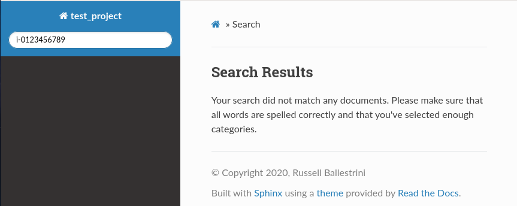
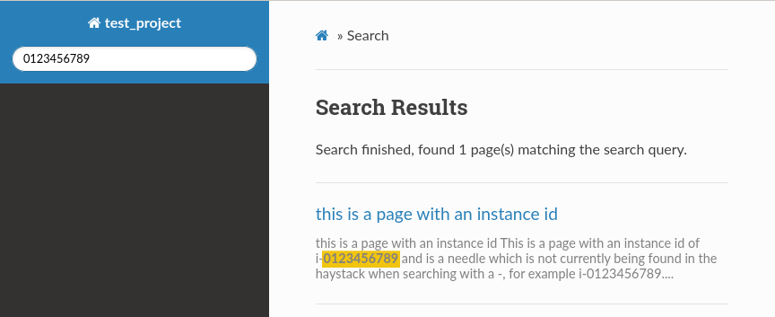

test_sphinx
###########

This is a test repo I'm using to try to debug Sphinx index/search for keywords which have dashes or periods, like instance ids, UUIDs, or IP addresses.

This screenshot documents the issue.

This screenshot document an inconvenient "user aware" work around.

Ideally I would like to find a solution which does not require the user to know how to search.

I've found hints here, but I'm not sure how to implement, please halp.

Apparently we can alter the indexer's tokenizer to ignore certain charecters or we can add the dash or period to the char set which means they we be part of the "word".

* http://sphinxsearch.com/docs/current/conf-ignore-chars.html
* https://github.com/sphinxsearch/sphinx/blob/master/sphinx.conf.in

environment setup
=================

You can reproduce this environment by following these steps, or clone this repo.

create Python virtualenv for this project::

 python3 -m venv env

source Python virtualenv::

 . env/bin/activate

install dependencies into virtualenv::

 pip install -r requirements.txt 

initialize Sphinx project, you may skip this step if you cloned this repo, it was already done::

 sphinx-quickstart

